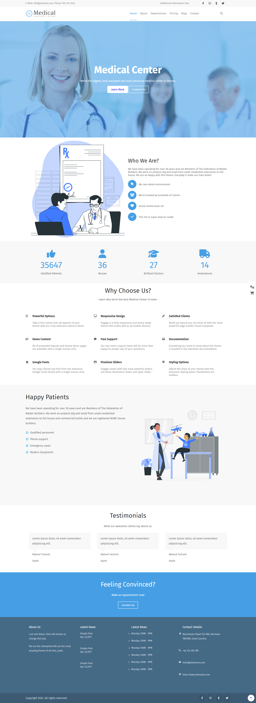

<p align="center">
  
</p>

<h1 align="center">🏥 MedicalCenter — Responsive Medical Website</h1>

<p align="center">
  <em>A modern, elegant, and fully responsive medical center website — built with HTML, CSS & Font Awesome.</em>
</p>

<p align="center">
  
  
  
  
</p>

<p align="center">
  <a href="#-application-demo-">🎥 Application Demo</a>
  &nbsp;&nbsp;|&nbsp;&nbsp;
  <a href="#-screenshots-️">📸 Screenshots</a>
</p>

---

## 📖 Project Description

**MedicalCenter** is a premium, pixel-perfect website designed for healthcare professionals, clinics, and medical centers. Built with **HTML5 and CSS3** — showcasing clean, semantic markup combined with powerful CSS techniques and a responsive layout.

The website features a stunning hero section, about us, statistics numbers, service features, patient testimonials, and a fully responsive layout that adapts beautifully from desktop to mobile.

> 💡 **Why this project stands out:** It demonstrates front-end development skills including Flexbox layouts, responsive design with media queries, hover transitions, and a cohesive design system — all tied together with a professional medical theme.

---

## 🎥 Application Demo 🎬

<div align="center">
  <video src="https://github.com/user-attachments/assets/c740c9b7-e5b9-460a-a104-31f11e7e1a1c" width="800" controls="controls" muted="muted"></video>
</div>

---

## 📸 Screenshots 🖼️

<div align="center">
  <table>
    <tr>
      <th align="center">Screen</th>
      <th align="center">🖥️ Desktop View</th>
      <th align="center">📱 iPad Pro</th>
      <th align="center">📲 iPhone 14 Pro Max</th>
    </tr>
    <tr>
      <td align="center"><strong>Landing Page</strong></td>
      <td align="center"></td>
      <td align="center"></td>
      <td align="center"></td>
    </tr>
  </table>
</div>

---

## 📖 Table of Contents

- [🛠️ Technologies & Styles Used](#️-technologies--styles-used-)
- [✨ Core Features](#-core-features)
- [🗺️ Application Sections](#️-application-sections)
- [🚀 Installation Instructions](#-installation-instructions)
- [💻 How to Run the Development Server](#-how-to-run-the-development-server)
- [🤝 How to Contribute](#-how-to-contribute)
- [✍️ Author](#️-author)

---

## 🛠️ Technologies & Styles Used 🎨

| Technology | Purpose | Details |
|:---:|:---|:---|
|  | **Structure** | Semantic HTML5 elements |
|  | **Styling** | Advanced CSS3 with Flexbox, transitions & media queries |
|  | **Icons** | Social media, service, medical, and UI icons |

---

## ✨ Core Features

<table>
  <tr>
    <td width="50%">

### 🎯 User Interface
- ✅ **Navigation Bar** with menu options
- ✅ **Responsive Menu** for mobile screens
- ✅ **Contact Information** accessible at the top
- ✅ **Professional Design** tailored for medical services

    </td>
    <td width="50%">

### 📱 Responsive Design
- ✅ **Multiple Breakpoints**: Adapts to desktop, tablet, and mobile views
- ✅ **Fluid Layout** using media queries
- ✅ **Mobile-Friendly Adjustments**

    </td>
  </tr>
</table>

---

## 🗺️ Application Sections

The website is organized into the following sections (top to bottom):

```
┌─────────────────────────────────────────────┐
│  🔝 Top Bar                                 │
│  ├── Contact Info (Email, Phone)            │
│  └── Social Icons                           │
├─────────────────────────────────────────────┤
│  🔝 Navigation Bar                          │
│  ├── Logo                                   │
│  └── Menu: Home|About|Departments|Pricing...│
├─────────────────────────────────────────────┤
│  🏠 Hero / Header Section                   │
│  ├── Welcome Title                          │
│  └── Call to Action Buttons                 │
├─────────────────────────────────────────────┤
│  👤 About Section                            │
│  ├── Image and Description                  │
│  └── Key benefits                           │
├─────────────────────────────────────────────┤
│  📊 Numbers Section                          │
│  └── Statistics (Patients, Nurses, Doctors) │
├─────────────────────────────────────────────┤
│  🛠️ Why Choose Us Section                    │
│  └── Features Grid (Responsive, Support...) │
├─────────────────────────────────────────────┤
│  🧑‍⚕️ Patients Section                        │
│  └── Information and highlights             │
├─────────────────────────────────────────────┤
│  💬 Testimonials Section                     │
│  └── Client Quotes                          │
├─────────────────────────────────────────────┤
│  📋 Footer                                   │
│  ├── About Us snippet                       │
│  ├── Latest News                            │
│  ├── Contact Details                        │
│  └── Copyright Notice                       │
└─────────────────────────────────────────────┘
```

---

## 🚀 Installation Instructions

### Prerequisites

- Any modern web browser (Chrome, Firefox, Safari, Edge)
- A code editor (VS Code recommended)

### Steps

**1. Clone the repository or download the files.**

**2. Navigate to the project directory:**

```bash
cd MedicalCenter
```

**3. Open in your browser:**

```bash
# Simply open the index.html file in your browser
```

---

## 💻 How to Run the Development Server

While you can open `index.html` directly, using a live server provides auto-reload on file changes:

### Option 1: VS Code Live Server (Recommended)

```
1. Install the "Live Server" extension in VS Code
2. Right-click on index.html
3. Select "Open with Live Server"
4. Browser opens at http://127.0.0.1:5500
```

---

## 🤝 How to Contribute

Contributions are always welcome! Here's how you can help:

```
1. 🍴 Fork the repository
2. 🌿 Create a feature branch        →  git checkout -b feature/AmazingFeature
3. ✏️  Make your changes              →  Edit files
4. 💾 Commit your changes            →  git commit -m "Add: AmazingFeature"
5. 📤 Push to the branch             →  git push origin feature/AmazingFeature
6. 🔃 Open a Pull Request            →  Compare & submit on GitHub
```

---

## ✍️ Author

<p align="center">
  <a href="https://github.com/waleedtarbosh">
    
  </a>
</p>

<p align="center">
  <strong>Waleed Tarbosh</strong><br/>
  Front-End Developer
</p>

---

<p align="center">
  <a href="#-medicalcenter--responsive-medical-website">⬆️ Back to Top</a>
</p>
